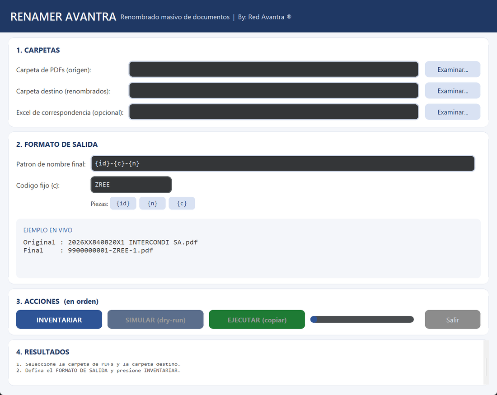

# Renamer Avantra

**Renombrado masivo de documentos PDF con formato de salida configurable**

By: Red Avantra ®

---

Renamer Avantra es una herramienta de escritorio para renombrar grandes
volúmenes de archivos PDF a partir de una **tabla de correspondencia**
(Excel). Está pensada para procesos documentales donde los archivos
llegan con un identificador de origen (por ejemplo, un número de
radicado) y el sistema de destino exige otro formato de nombre.

La característica diferencial es el **formato de salida configurable**:
el usuario define la anatomía del nombre final con una plantilla
parametrizable y ve el resultado en vivo antes de procesar nada.



## Características

- **Formato de salida configurable** con plantilla de tokens:
  - `{id}` — identificador de destino (viene del Excel de correspondencia)
  - `{n}` — consecutivo cuando una operación recibe varios archivos
  - `{c}` — código fijo configurable
- **Ejemplo en vivo**: la ventana muestra la transformación
  `original -> final` mientras se edita el patrón
- **Doble validación**: simulación completa antes de ejecutar (dry-run)
  y bloqueo automático ante duplicados, colisiones de nombre o
  correspondencias faltantes
- **Trazabilidad total**: cada ejecución genera un `reporte.csv` con la
  relación archivo original -> archivo final y su estado
- **Operación no destructiva**: los archivos originales nunca se
  modifican; solo se crean copias renombradas en la carpeta destino
- **Sin instalación**: ejecutable portable para Windows (disponible en
  Releases), sin permisos de administrador
- **Interfaz gráfica** (CustomTkinter) y **consola** (CLI) con las
  mismas capacidades

## Formato de salida: cómo funciona

El nombre final se construye con una plantilla. Ejemplos:

| Patrón | Resultado | Cuándo usarlo |
|---|---|---|
| `{id}` | `9900000001.pdf` | Operaciones de un solo documento |
| `{id}-{n}` | `9900000001-1.pdf` | Numeración explícita siempre |
| `{id}-{c}-{n}` | `9900000001-ZREE-1.pdf` | Con código de formato |

Si una misma operación de destino recibe varios archivos, `{n}` se
numera automáticamente (1, 2, 3...) en orden alfabético. Si recibe uno
solo, no hay colisión y el patrón produce un único nombre limpio.

La aplicación valida el patrón en vivo:
- exige la presencia de `{id}` (sin él, las operaciones serían
  indistinguibles)
- rechaza tokens desconocidos
- exige que `{n}` vaya después de `{id}`

## Estructura esperada de entrada

```
carpeta_origen/
├── 2026XX840820X1 ACME CORPORACION.pdf
├── 2026XX840823X1 BETA SERVICIOS.pdf
└── ...
```

- Los nombres deben iniciar con el identificador de origen
  (patrón configurable: por defecto `4 dígitos + 2 letras + números +
  1 letra + 1 dígito`, ejemplo ficticio `2026XX840820X1`).
- El Excel de correspondencia contiene dos columnas (el programa las
  detecta automáticamente por su contenido, sin importar el orden ni
  el título):

| ID de origen | ID de destino |
|---|---|
| 2026XX840820X1 | 9900000001 |
| 2026XX840823X1 | 9900000002 |

## Flujo de uso

```
1. INVENTARIAR -> lee los nombres, valida estructura y genera la lista
                 de identificadores (ids_para_consulta.txt)
2. (manual)    -> consulta los identificadores en el sistema fuente y
                 descarga el Excel de correspondencia
3. SIMULAR     -> muestra el plan completo sin modificar nada
4. EJECUTAR    -> copia los archivos renombrados + reporte.csv
5. (manual)    -> carga la carpeta destino en el sistema de destino
```

La lista de identificadores se genera en lotes de 200, listo para
pegar en consultas que limitan el volumen por búsqueda.

## Uso — Interfaz gráfica

```bash
python src/renamer_gui.py
```

O descarga el ejecutable portable desde
[Releases](https://github.com/pruebadedireccion/renamer-avantra/releases)
y haz doble clic (no requiere instalación).

## Uso — Consola (CLI)

```bash
# 1. Inventario + lista de identificadores (no modifica nada)
python src/renamer_cli.py --carpeta CARPETA

# 2. Simulación con el Excel de correspondencia (dry-run)
python src/renamer_cli.py --carpeta CARPETA --mapeo mapeo.xlsx

# 3. Renombrado real (copia a carpeta destino)
python src/renamer_cli.py --carpeta CARPETA --mapeo mapeo.xlsx \
       --destino SALIDA --ejecutar

# Formato de salida personalizado
python src/renamer_cli.py --carpeta CARPETA --mapeo mapeo.xlsx \
       --patron "{id}-{c}-{n}" --codigo ZREE --ejecutar
```

## Arquitectura

```
┌─────────────────┐     ┌──────────────────┐     ┌─────────────────┐
│  Carpeta origen │     │  renamer_core    │     │ Carpeta destino │
│  PDFs con id    │ --> │  inventario      │ --> │ archivos con    │
│  de origen      │     │  mapeo + plan    │     │ nombre final    │
└─────────────────┘     │  validaciones    │     │ + reporte.csv   │
                        └────────┬─────────┘     └─────────────────┘
                                 │
                    ┌────────────┴────────────┐
                    │                         │
             ┌──────┴──────┐           ┌──────┴──────┐
             │  GUI        │           │  CLI        │
             │ (ventana)   │           │ (consola)   │
             └─────────────┘           └─────────────┘
```

El diseño separa la **lógica** (`renamer_core.py`) de las interfaces
(`renamer_gui.py` / `renamer_cli.py`): las validaciones, la numeración
y la trazabilidad viven en un único módulo probado, compartido por
ambas interfaces.

## Salvaguardas incorporadas

| Situación | Comportamiento |
|---|---|
| Archivo duplicado de descarga (`archivo (1).pdf`) | Detectado como anomalía, detiene el proceso |
| Archivo sin el identificador de origen | Anomalía, detiene el proceso |
| Id sin correspondencia en el Excel | SIN MAPEO, detiene la ejecución |
| Dos archivos con el mismo nombre destino | Colisión detectada, ejecución bloqueada |
| Archivo destino ya existente (re-ejecución) | Aviso y omisión de la copia |
| Patrón inválido | Aviso en vivo, no permite avanzar |

## Instalación (modo desarrollo)

```bash
git clone https://github.com/pruebadedireccion/renamer-avantra.git
cd renamer-avantra
pip install -r requirements.txt
python src/renamer_gui.py
```

Requisitos: Python 3.10+ en Windows.

## Stack tecnológico

| Tecnología | Uso |
|---|---|
| Python 3.11 | Lógica de negocio |
| CustomTkinter | Interfaz gráfica moderna |
| openpyxl | Lectura de Excel de correspondencia |
| Expresiones regulares | Extracción y validación de identificadores |
| PyInstaller | Empaquetado portable (Release) |

## Licencia

MIT — ver [LICENSE](LICENSE).